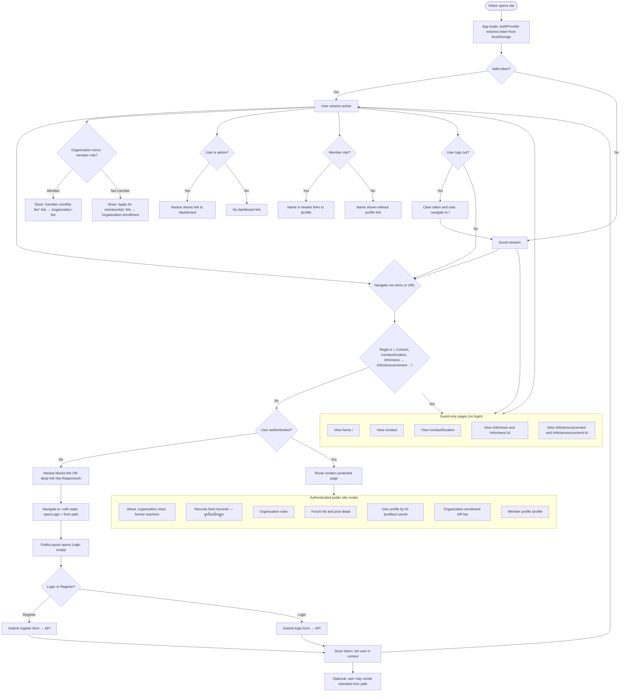
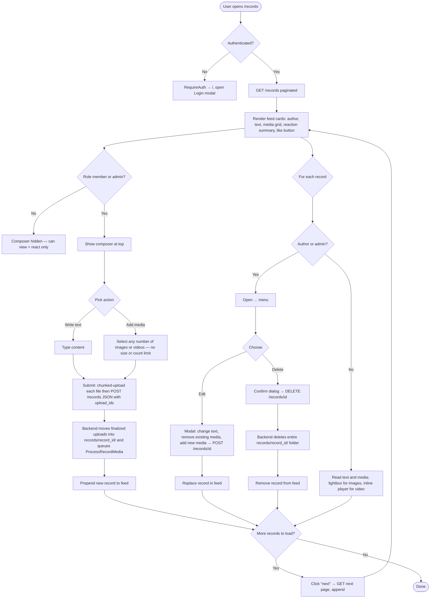
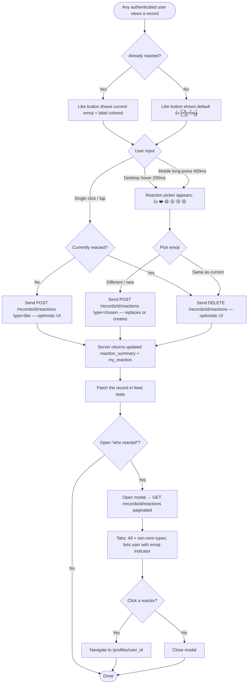
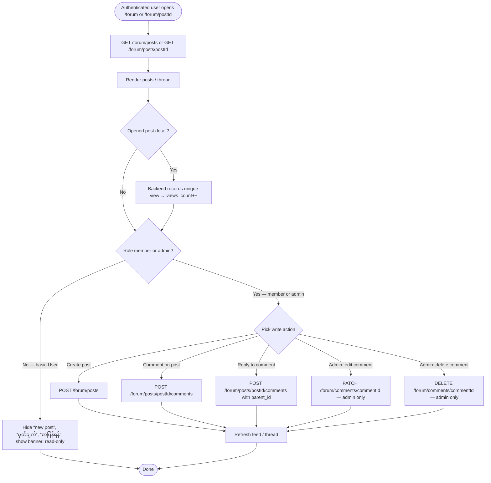
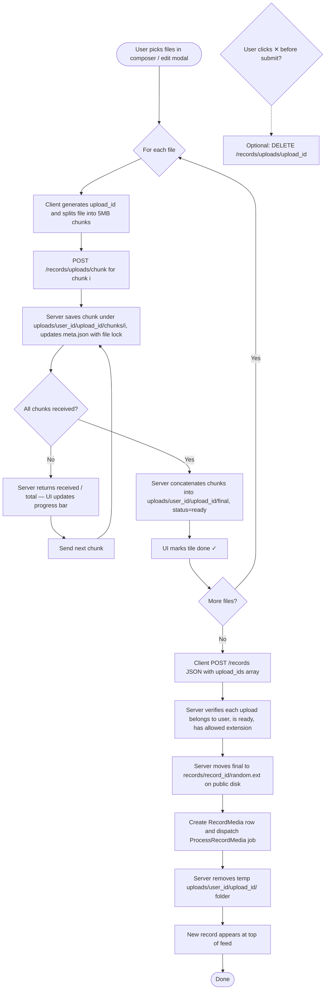
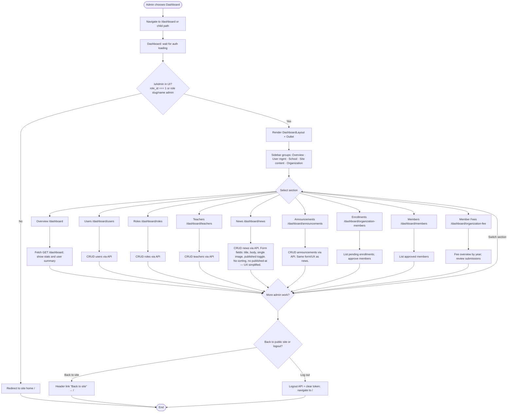

# behs3bahan UI — Activity diagrams

Mermaid **flowchart** diagrams (activity-style) for the React app in `behs3bahan_ui`. Preview in GitHub, VS Code Markdown preview with Mermaid support, or [mermaid.live](https://mermaid.live).

---

## 1. Public website usage

Covers `PublicLayout`, `Navbar` guest rules, `RequireAuth` deep links, login/register modals, and main member vs non-member navigation.



### Notes (website)

- **Guest-only URLs** without login: `/`, `/contact`, `/contact/location`, **`/info/news`** (+ `/info/news/:id`), **`/info/announcement`** (+ `/info/announcement/:id`), and `/info/rules-and-regulations` (see `Navbar.jsx` `isGuestAllowedPath`).
- All other public-layout routes are wrapped in `RequireAuth` in `App.jsx`; unauthenticated access redirects to `/` with `openLogin: true` (same as many navbar clicks).
- **Member** vs **non-member** changes the “Organization” submenu (`organization-fee` vs `organization-enrollment`).
- **Forum** (`/forum`) is now **read-open** for any logged-in user (and the view still counts), but writes (posts, comments, replies, edits, deletes) are restricted to members/admins both on the API and in the UI.
- **Records** (`/records`, label **မှတ်တမ်းများ**) is a **single Facebook-style feed page** (no dropdown). Any logged-in user can view AND react; only members and admins can create / edit / delete posts.

---

## 1b. Records feed usage (မှတ်တမ်းများ)



---

## 1c. Reactions on a record (FB-style)



## 1d-info. News & Announcements (public, no auth)

```mermaid
flowchart TB
  IStart([Visitor opens home /]) --> Home[Home shows 2-column “သတင်း နှင့် ကြေငြာချက်များ” panel]
  Home --> HomeFetch[Parallel GET /public/news + GET /public/announcements]
  HomeFetch --> Cards[Render up to 5 newest per column. No images on home preview. Green vs amber accents to distinguish.]
  Cards --> ClickKind{User clicks…}
  ClickKind -->|သတင်းများ → all| ListN[Navigate /info/news]
  ClickKind -->|ကြေငြာချက်များ → all| ListA[Navigate /info/announcement]
  ClickKind -->|One news item| DetN[Navigate /info/news/:id]
  ClickKind -->|One announcement| DetA[Navigate /info/announcement/:id]

  ListN --> FetchListN[GET /public/news]
  ListA --> FetchListA[GET /public/announcements]
  FetchListN --> Horizontal[Horizontal cards: image left, title/desc/“ဆက်ဖတ်ရန် →” right; stacks on mobile]
  FetchListA --> Horizontal

  Horizontal --> Pick{Click a card}
  Pick -->|Yes| Detail[GET /public/{kind}/:id → full body + hero image]

  DetN --> Detail
  DetA --> Detail
  Detail --> Back[Back-to-list link]
  Back --> Horizontal
```

### Notes (info pages)

- `/info/news` and `/info/announcement` (plus `:id` detail) are **fully public** — no login required.
- The old plural `/info/announcements` redirects to `/info/announcement`.
- Server only returns rows with `is_published = true` on public endpoints, newest first by `id`.
- Home page previews call the same public endpoints in parallel, render up to 5 newest per column, and skip images for a compact look. Each column has its own accent (green for news, amber for announcements) so they read as separate things.

---

## 1d. Forum read-only vs member/admin



### Notes (forum read-vs-write)

- `GET /forum/posts` and `GET /forum/posts/{postId}` are now only protected by `auth:sanctum`.
- All write endpoints (`POST /forum/posts`, `POST /forum/posts/{postId}/comments`, `PATCH/DELETE /forum/comments/{commentId}`) remain under `member_or_admin`.
- The UI hides the “new post”, “မှတ်ချက်”, and “စာပြန်ရန်” affordances for users without member/admin role, and shows a small banner explaining the read-only state.

---

## 1e. Chunked media upload (for records)



### Notes (chunked uploads)

- No size or count caps on the frontend or backend. Only the **file extension whitelist** (`jpeg, jpg, png, gif, webp, mp4, mov, avi, webm, mkv`) is enforced for security.
- Per-request body is tiny (~5 MB), so PHP / Nginx limits can stay modest even for multi-GB videos.
- The chunked endpoint is **idempotent** for the same `(upload_id, chunk_index)`, so the client can safely retry on transient failures.
- `meta.json` writes are guarded with `flock(LOCK_EX)` so out-of-order or concurrent chunk uploads don't lose state.
- After attachment, the server enqueues `App\Jobs\ProcessRecordMedia` which currently re-verifies size / MIME from disk and is the hook point for future thumbnail / poster / virus-scan work.

---

### Notes (records + reactions)

- Backend route prefix is `/records` (no more `/gallery/...`).
- Storage folders are now `records/{record_id}/...`.
- The single navbar entry is labelled **မှတ်တမ်းများ** and points to `/records`.
- Reactions are limited to one per user per record, are immediately replaceable, and use optimistic UI on the client (rolled back on error).
- Mobile UX: long-press the Like button opens the picker; tap toggles like.

---

## 2. Admin dashboard usage

Covers `Dashboard.jsx` admin gate, `DashboardLayout` sidebar, and nested routes under `/dashboard/*`.



### Notes (dashboard)

- **Admin gate** is client-side in `Dashboard.jsx` (`isAdmin` from `AuthContext`). Non-admins are sent to `/` even if they type `/dashboard` manually.
- Sidebar labels map to routes in `DashboardLayout.jsx` and `App.jsx` nested routes.
- **Overview** loads aggregated data from `GET /api/dashboard` (see `Overview.jsx` / `authService.getDashboard`).
- **Site content** group hosts the **News** and **Announcements** admin screens. Both share `InfoPostsAdmin.jsx`, only the title and underlying service differ (`newsAdminService` vs `announcementAdminService`).

---

## Rendering

Same as `API_CLASS_DIAGRAM.md`: paste fenced blocks into [mermaid.live](https://mermaid.live) or use Markdown preview with Mermaid support.
