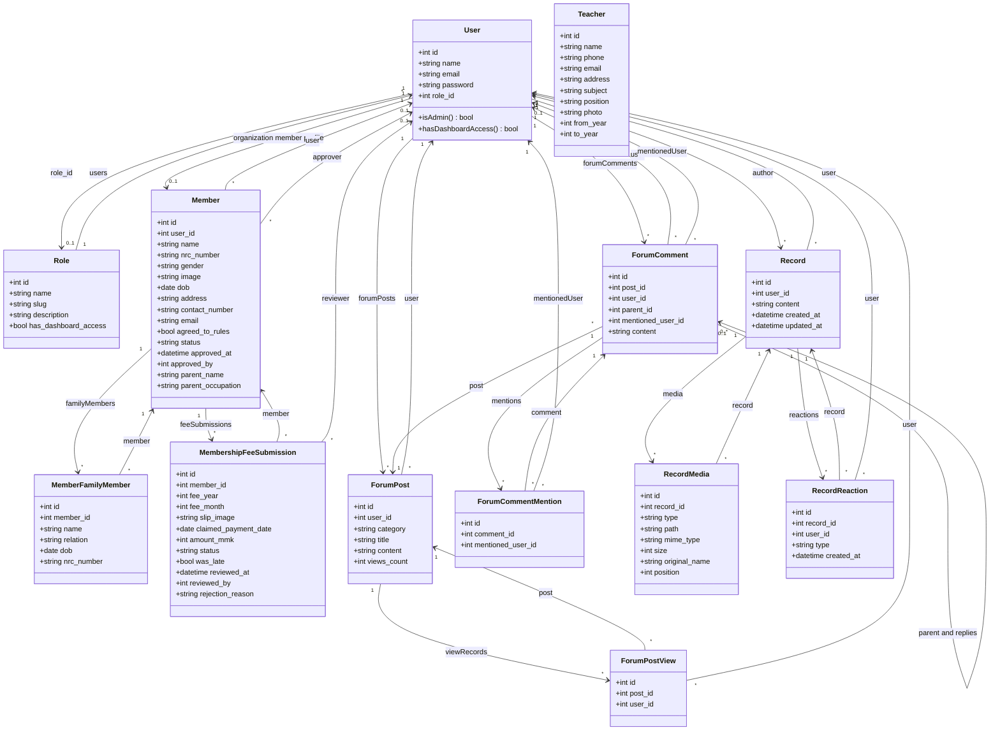

# behs3bahan API — Class diagram

This diagram reflects the Laravel Eloquent domain models in `behs3bahan_api/app/Models` and their relationships. Controllers inherit from `App\Http\Controllers\Controller` and orchestrate HTTP; they are summarized in a separate box.

## Domain model (Eloquent)

## HTTP layer (controllers)

Controllers map routes to models and validation. They do not add persistent fields beyond request handling.

| Controller | Main responsibilities |
|------------|------------------------|
| `AuthController` | Register, login, logout; issues Sanctum tokens |
| `UserController` | Admin CRUD on `User`; `updateRole` |
| `RoleController` | Admin CRUD on `Role` |
| `TeacherController` | Public list; admin CRUD; photo storage |
| `OrganizationMemberController` | Enroll (`Member`); admin pending list and approve |
| `MemberController` | Admin list approved members |
| `MemberProfileController` | Current member profile, update, avatar; public-ish profile by `userId` |
| `OrganizationFeeController` | Member fee status and slip upload; admin overview and review |
| `ForumController` | Posts and comments; views; mention parsing |
| `RecordController` | မှတ်တမ်းများ feed (text + image/video) with FB-style reactions (6 types), per-record folder storage, owner/admin edit/delete; attaches finalized chunked uploads via `upload_ids[]` and dispatches `ProcessRecordMedia` job |
| `RecordUploadController` | Chunked upload sessions for record media (no size / count caps); writes chunks under `storage/app/uploads/{user}/{upload_id}/chunks/*` with file-locked `meta.json`; concatenates into `final` once complete |
| `DashboardController` | Admin dashboard stats |

## Middleware (cross-cutting)

| Middleware | Effect |
|------------|--------|
| `auth:sanctum` | Requires valid Bearer token for protected routes |
| `EnsureUserIsAdmin` | `role_id === 1` |
| `EnsureUserIsMemberOrAdmin` | Admin or role slug/name `member` (forum **writes**, record **writes**) |

---

To render the Mermaid diagram, use GitHub, VS Code with a Mermaid preview extension, or [mermaid.live](https://mermaid.live).
